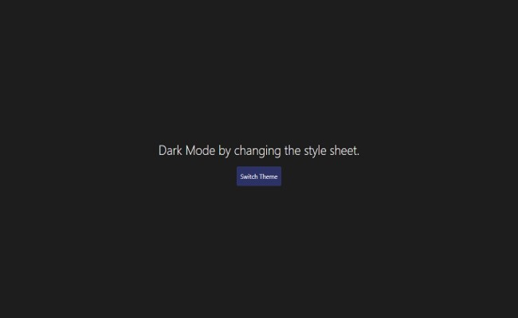

# dark-theme
A dark theme displays dark surfaces across the majority of a UI. It's designed to be a supplemental mode to a default (or light) theme. Lets quickly jump into a small Demo.


# Thoughtly (Web Version)
* Built with Vanilla JS.💙

# Features:
* Dark to Light Theme switch

# Hosted on Netlify(🔥):
https://dark-themed.netlify.app/

# Getting started:
```
> git clone 'https://github.com/gtchakama/dark-theme'
> cd dark-theme

```

# Screenshots:

 Homepage



 Web App score 
 
 


# JS Concepts Used:
* Dom Traversal

# Misc:
* CSS Animation
